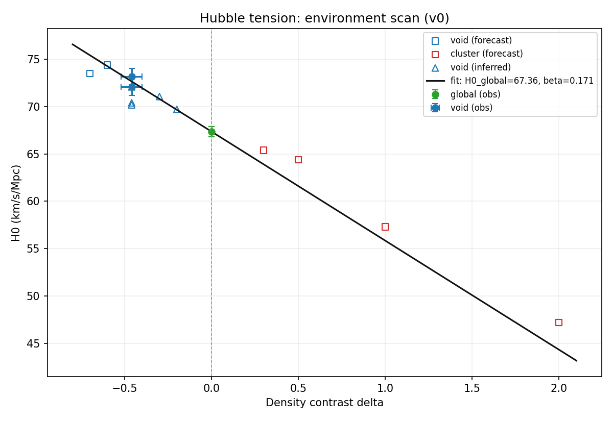
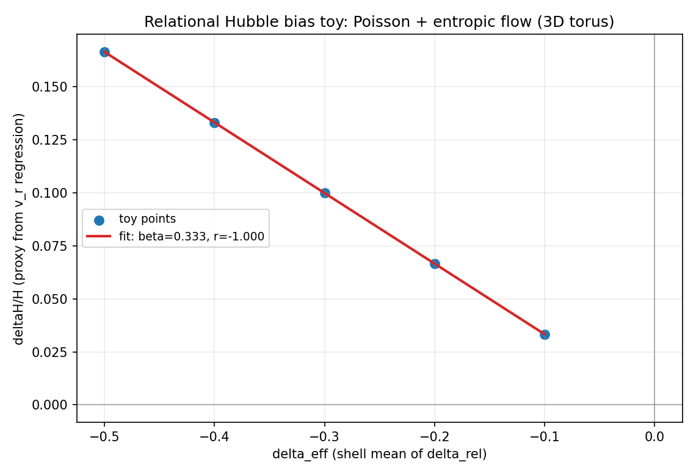

# 哈勃张力的环境修正：一种可复现、可证伪的 v0 关系网络模型

作者：Baiyi Wang (王柏毅)  
日期：2026-01-31  
版本：v0（研究笔记 / 预印本草稿，非同行评审）

---

## 摘要

哈勃张力指早期宇宙（CMB）与晚期宇宙（距离梯子/超新星等）给出的哈勃常数 \(H_0\) 测量值存在显著差异。本文提出一种可检验的“环境/观测者效应”解释：**局部测得的 \(H_0\) 随观测者周围的大尺度密度对比度 \(\delta\) 系统性变化**。在最小线性参数化下，
\[
H_0(\delta)=H_{0,\mathrm{ref}}\,(1-\beta\,\delta),
\]
其中 \(H_{0,\mathrm{ref}}\) 为参考膨胀率（实践中常以 CMB/Planck 值作为锚点；本质上是归一化/口径选择），\(\beta>0\) 为密度—膨胀耦合系数。该模型预测：欠密环境（\(\delta<0\)）中局部 \(H_0\) 偏高；过密环境（\(\delta>0\)）中局部 \(H_0\) 偏低。仓库提供 v0 的可复现数据表与拟合脚本（`math/hubble_env_scan/`），并明确给出证伪条件。现阶段外部 N-body 模拟与部分观测结果在“方向与量级”上与该模型不矛盾，但点集规模与 \(\delta\) 口径统一仍待扩展；因此本文定位为一个可复现、可被反驳的 v0 检验稿。

---

## 1. 引言：问题与目标

### 1.1 哈勃张力（简述）

典型数值（示例）：

- 早期宇宙（Planck 2018，CMB）：\(H_0 \approx 67.4\ \mathrm{km\,s^{-1}\,Mpc^{-1}}\)
- 晚期宇宙（SH0ES 距离梯子）：\(H_0 \approx 73.2\ \mathrm{km\,s^{-1}\,Mpc^{-1}}\)

二者差异约 \(\sim 9\%\)，达到多西格玛显著性，是现代宇宙学的核心张力之一。

### 1.2 本文目标

本文不试图“宣布解决”。目标更窄、更工程化：

- 给出一个**最小可检验**的参数化模型；
- 给出**可复现管线**（数据表、脚本、JSON/图输出）；
- 给出**明确证伪条件**，使得未来数据可以直接推翻或升级模型。

---

## 2. 模型：环境修正的最小线性形式

### 2.1 定义

- \(H_{0,\mathrm{ref}}\)：参考膨胀率（本文以 CMB/Planck 推断值作为锚点；口径选择）
- \(\delta\)：局部密度对比度（定义依赖具体文献口径；见 3.2）
- \(\beta\)：密度—膨胀耦合系数（待由数据拟合/约束）

### 2.2 主方程

\[
H_0(\delta)=H_{0,\mathrm{ref}}\,(1-\beta\,\delta).
\]

直观含义：

- 欠密（\(\delta<0\)）\(\Rightarrow\ H_0(\delta) > H_{0,\mathrm{ref}}\)
- 过密（\(\delta>0\)）\(\Rightarrow\ H_0(\delta) < H_{0,\mathrm{ref}}\)

### 2.3 与线性理论基线的关系（对照）

在简单线性近似中常出现 \(\delta H/H \sim -(f/3)\delta\)，其中 \(f\simeq \Omega_m^{0.55}\)。取 Planck-2018 类参数 \(\Omega_m\approx 0.315\) 时，
\[
\beta_{\mathrm{lin}}\approx \frac{f}{3}\approx 0.177.
\]
该数量级为 \(\beta\) 的外部参照基线；本文的 v0 拟合结果在同量级范围内。

### 2.4 关系论的一阶推导（toy，操作性）：\(\beta=f/3\)

上面的“线性理论基线”可以在本仓库的关系算子语言中给出一个一阶推导（toy，但可复现），从而把
\(\beta\) 还原为一个明确需要进一步计算/约束的动力学量 \(f\)（增长率/响应强度）：

1. **几何/算子**：在 3D torus 网格关系图上，组合拉普拉斯 \(L=D-A\) 在连续极限满足 \(L\approx-\nabla^2\)。
2. **势（Poisson/Green 响应）**：令 \(\delta_{\mathrm{rel}}\) 为观测者环境的“关系密度对比度”（toy 中取补偿 top-hat/高斯，使全局平均为 0），定义
   \[
   L\phi=-\delta_{\mathrm{rel}}\quad(\Rightarrow\ \nabla^2\phi=\delta_{\mathrm{rel}}).
   \]
3. **动力学（熵梯度/势梯度流）**：取
   \[
   \mathbf{v}=-f\,\nabla\phi,
   \]
   其中 \(f\) 是无量纲响应系数（在标准宇宙学里对应 growth rate；在 toy 脚本中对应参数 `--v-scale`）。
4. **观测口径（距离梯子回归偏差）**：在壳层/窗口权重 \(w(r)\) 下，距离梯子回归得到的 \(H\) 斜率偏差可写成
   \[
   \frac{\delta H}{H}\approx \frac{\sum w(r)\,r\,v_r}{\sum w(r)\,r^2}\approx -\frac{f}{3}\,\delta_{\mathrm{eff}}
   \quad\Rightarrow\quad \beta=\frac{f}{3}.
   \]

仓库提供端到端 toy 脚本 `math/spectral_graph/run_relational_hubble_beta_poisson_3d_v0.py`，在默认 \(f=1\) 的 toy 标定下得到 \(\beta\approx 1/3\)；若取 \(f\approx0.51\)，则 \(\beta\approx0.17\) 与 v0/v1 拟合量级一致。

---

## 3. 数据与口径（v0）

### 3.1 v0 管线概览

本仓库提供了一个最小可复现管线：

- 数据表：`math/hubble_env_scan/hubble_env_data_v0.csv`
- 拟合脚本：`math/hubble_env_scan/run_hubble_env_scan_v0.py`
- 输出：`math/hubble_env_scan/results_v0.json` 与 `math/hubble_env_scan/plot_v0.png`
- 自检：`math/hubble_env_scan/validate_hubble_env_data_v0.py`

### 3.2 \(\delta\) 的口径问题（当前局限）

本文当前的 \(\delta\) 多来自不同文献的“局部密度/过欠密”估计；其平滑尺度、定义域、偏置修正可能不同。v0 阶段的做法是：

- 先接受文献给出的 \(\delta\) 作为输入；
- 在结果与结论中明确标注“v0 口径”；
- 把“口径统一/敏感性分析”作为 v1 的首要工作之一（见 7.2）。

---

## 4. 结果（v0）

### 4.1 基于示例点的数量级估算

以（示例）KBC 空洞密度对比度 \(\delta\approx -0.46\) 与局部 \(H_0\approx 72.1\) 为例（并以 \(H_{0,\mathrm{ref}}=67.4\) 为锚点）：
\[
72.1 \approx 67.4\,(1-\beta(-0.46))=67.4\,(1+0.46\beta)
\Rightarrow \beta \approx 0.15.
\]

### 4.2 v0 点集拟合摘要（以脚本输出为准）

仓库脚本 `math/hubble_env_scan/run_hubble_env_scan_v0.py` 的 v0 输出包含对 \(H_{0,\mathrm{ref}}\) 与 \(\beta\) 的拟合估计，以及与线性理论基线的并排对照（详见 `results_v0.json`）。当前点集规模仍偏小，v0 结果主要用于“流程验证”和数量级参考，而非最终统计结论。

### 4.3 外部模拟证据（方向与量级参照）

外部 N-body 模拟工作报告了“局部过密与 \(H_0\) 偏差负相关”的现象，与本模型的方向一致。仓库中已包含一部分趋势线数据提取与拟合（见 `math/hubble_env_scan/gavas2024_figure3_extraction/`），用于给出 \(\beta\sim 0.1\) 量级的外部参照。

---

## 5. 可检验预测

在 \(\beta>0\) 的前提下，模型给出可直接检验的环境序关系：

- 欠密区域（大空洞）应测得更高的局部 \(H_0\)
- 过密区域（星系团等）应测得更低的局部 \(H_0\)

示例预测（数值与范围、以及其口径依赖性，详见 `docs/physics/hubble_tension.md`）：

- Cold Spot（若可视为大欠密）：\(H_0\sim 73.5\)–\(74.4\)
- 星系团：\(H_0\sim 64\)–\(65\)

---

## 6. 证伪条件（v0 口径）

在 v0 的定义与口径下，以下任一模式若被稳定观测到，则模型必须被修正或放弃（与 `docs/verification/predictions.md` 一致）：

- 多环境拟合得到 \(\beta \le 0\)，且显著性 \(\ge 2\sigma\)
- 在 \(\delta>0\) 的过密环境中，测得的 \(H_0\) 系统性高于 \(H_{0,\mathrm{ref}}\)（\(\ge 2\sigma\)）
- 残差呈显著非线性且一阶修正无法吸收（需要升级到非线性或分尺度模型；若仍失败则否定该解释路径）

---

## 7. 讨论：已知局限与下一步

### 7.1 v0 的已知局限

- **点集偏少**：目前更像“证明管线能跑通”，而不是“统计定论”
- **\(\delta\) 口径不统一**：不同文献的平滑尺度/偏置校正差异可能显著影响 \(\beta\)
- **系统误差对照不足**：距离梯子校准链、选择效应、局域流/本动速度、宇宙方差等需要更系统的对照

### 7.2 v1 路线（建议优先级）

1. 建立“\(\delta\) 口径表”：对每个数据点记录定义、尺度、来源与可比性
2. 做敏感性分析：替换口径/去掉关键点/不同拟合设定，检查 \(\beta\) 的稳健性
3. 扩点：引入更多独立环境点（空洞、星系团、不同红移段），并区分“参与拟合点”与“纯预测检验点”

---

## 8. 复现方式（从仓库根目录运行）

```bash
pip install -r requirements.txt

# 运行 v0 环境扫描拟合与作图
python math/hubble_env_scan/run_hubble_env_scan_v0.py

# 数据自检（可选）
python math/hubble_env_scan/validate_hubble_env_data_v0.py

# 关系论一阶推导 toy（Poisson + entropic flow）
python math/spectral_graph/run_relational_hubble_beta_poisson_3d_v0.py
```

主要输出（路径固定）：

- `math/hubble_env_scan/results_v0.json`
- `math/hubble_env_scan/plot_v0.png`
- `math/spectral_graph/relational_hubble_beta_poisson_3d_results_v0.json`
- `math/spectral_graph/relational_hubble_beta_poisson_3d_plot_v0.png`

建议读者首先打开这张图：



以及这个 toy 推导图：



---

## 参考（仓库内整理）

更完整的背景、数据来源与引用线索见：

- `docs/physics/hubble_tension.md`
- `math/hubble_env_scan/README.md`
- `docs/verification/predictions.md`

